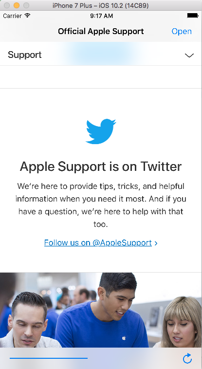

# EasyBrowser

A simple web browsing app with an action sheet popup that allows only two websites to be viewed based on their host name. The app contains an open button at the top to toggle websites to be opened. It also contains a refresh button and a progress bar at the bottom, which are seperated by flexible spacing.

### Screenshots of the Easy Browser App

                         Above: Screenshot of the "Main" screen of the Easy Browser app

                         Above: Screenshot demonstrates that the Twitter link does not open in the Easy Browser app

Code Source: Hacking with Swift - https://www.hackingwithswift.com
